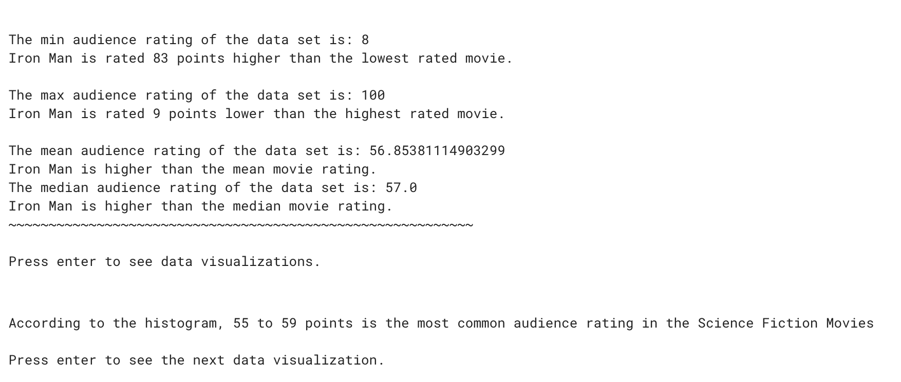

# Movie Data Analysis

A data analysis project comparing my favorite movie, *Iron Man*, to other science fiction movies.

## Demo

[View the project on Girls Who Code TextJam](https://hq.girlswhocode.com/TextJam/py/10037/27d188c1)

## How I Made It

- **Language:** Python
- **Libraries:** Pandas, Matplotlib
- **Dataset:** Rotten Tomatoes movies

I used the GWC Pathways project instructions and starter code to analyze movie ratings and create visualizations.

## What I Learned

- How to filter data with Pandas
- How to calculate statistics like mean and median
- How to create histograms and scatter plots
- How to interpret data visualizations

## What I Struggled With

I had trouble figuring out how to filter the dataset and compare my favorite movie with other science fiction movies.
